# Document Reports

DocuDesk provides comprehensive document analysis through its reporting system. This page explains how document reports work and how they can help you ensure your documents meet privacy, accessibility, and readability standards.

## Overview

The Document Reports system in DocuDesk enables you to:

- Identify files containing personal data
- Categorize the types of personal data present
- Track anonymization status
- Manage retention periods
- Document the legal basis for processing
- Maintain an audit trail of privacy-related actions
- Analyze documents for personal data that may require anonymization
- Check documents for WCAG accessibility compliance
- Assess the language level and readability of documents
- Track document changes through file hashing
- Generate detailed reports with actionable recommendations

## Automatic Report Generation

DocuDesk can automatically generate reports for documents as they are uploaded or modified in Nextcloud. This process works as follows:

1. When a file is created or modified in Nextcloud, DocuDesk detects the event
2. A document log entry is created to maintain an audit trail
3. If reporting is enabled, DocuDesk checks if a report already exists for the current version of the file
4. If no report exists (or the file has changed), a new report is created with a 'pending' status
5. Depending on the configuration, the report is either:
   - Processed immediately (synchronous processing)
   - Queued for processing by a background job (asynchronous processing)
6. The report is updated with the analysis results once processing is complete

### Report Generation Workflow

The following sequence diagram illustrates the report generation process:

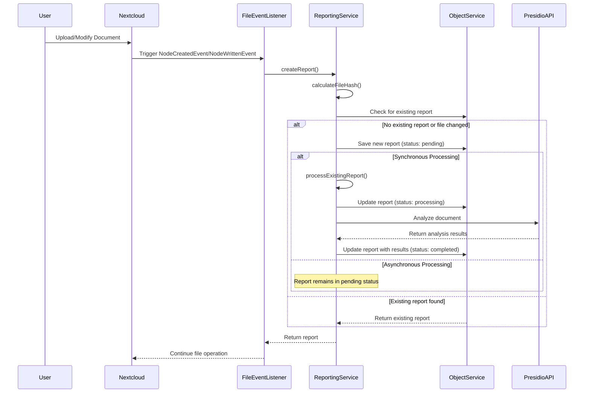
```mermaid
sequenceDiagram
    participant User
    participant Nextcloud
    participant FileEventListener
    participant ReportingService
    participant ObjectService
    participant PresidioAPI

    User->>Nextcloud: Upload/Modify Document
    Nextcloud->>FileEventListener: Trigger NodeCreatedEvent/NodeWrittenEvent
    FileEventListener->>ReportingService: createReport()
    ReportingService->>ReportingService: calculateFileHash()
    ReportingService->>ObjectService: Check for existing report
    
    alt No existing report or file changed
        ReportingService->>ObjectService: Save new report (status: pending)
        
        alt Synchronous Processing
            ReportingService->>ReportingService: processExistingReport()
            ReportingService->>ObjectService: Update report (status: processing)
            ReportingService->>PresidioAPI: Analyze document
            PresidioAPI-->>ReportingService: Return analysis results
            ReportingService->>ObjectService: Update report with results (status: completed)
        else Asynchronous Processing
            Note over ReportingService: Report remains in pending status
        end
    else Existing report found
        ObjectService-->>ReportingService: Return existing report
    end
    
    ReportingService-->>FileEventListener: Return report
    FileEventListener-->>Nextcloud: Continue file operation
```

### Configuration Options

The report generation process can be configured through the DocuDesk settings page:

- **Enable Reporting**: Turn automatic report generation on or off
- **Synchronous Processing**: Choose between immediate processing or background job processing
- **Confidence Threshold**: Set the minimum confidence level for entity detection (0-100%)
- **Store Original Text**: Choose whether to store the original document text in reports

### Processing Modes

DocuDesk supports two processing modes for report generation:

#### Synchronous Processing

In synchronous mode, reports are generated immediately when a file is created or modified. This provides instant feedback but may impact performance for large files or high-traffic environments.

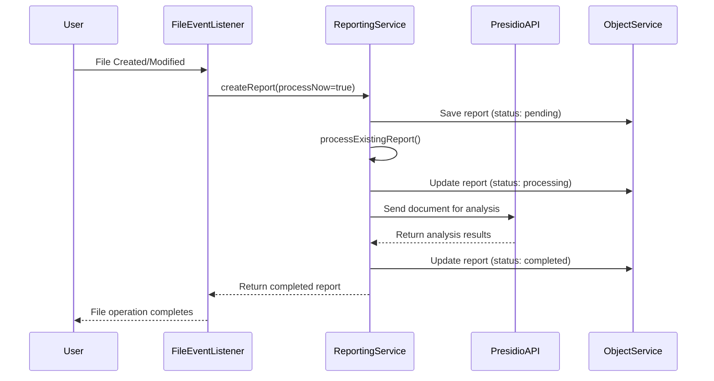
```mermaid
sequenceDiagram
    participant User
    participant FileEventListener
    participant ReportingService
    participant PresidioAPI
    participant ObjectService

    User->>FileEventListener: File Created/Modified
    FileEventListener->>ReportingService: createReport(processNow=true)
    ReportingService->>ObjectService: Save report (status: pending)
    ReportingService->>ReportingService: processExistingReport()
    ReportingService->>ObjectService: Update report (status: processing)
    ReportingService->>PresidioAPI: Send document for analysis
    PresidioAPI-->>ReportingService: Return analysis results
    ReportingService->>ObjectService: Update report (status: completed)
    ReportingService-->>FileEventListener: Return completed report
    FileEventListener-->>User: File operation completes
```

#### Asynchronous Processing (Recommended for Production)

In asynchronous mode, reports are queued for processing by a background job that runs periodically. This is more efficient for large environments as it:

- Reduces the impact on user experience
- Allows for better resource management
- Handles large volumes of documents more effectively
- Prevents timeouts when processing large files

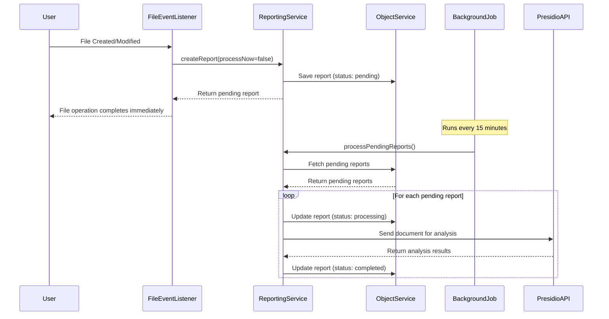
```mermaid
sequenceDiagram
    participant User
    participant FileEventListener
    participant ReportingService
    participant ObjectService
    participant BackgroundJob
    participant PresidioAPI

    User->>FileEventListener: File Created/Modified
    FileEventListener->>ReportingService: createReport(processNow=false)
    ReportingService->>ObjectService: Save report (status: pending)
    ReportingService-->>FileEventListener: Return pending report
    FileEventListener-->>User: File operation completes immediately

    Note over BackgroundJob: Runs every 15 minutes
    BackgroundJob->>ReportingService: processPendingReports()
    ReportingService->>ObjectService: Fetch pending reports
    ObjectService-->>ReportingService: Return pending reports
    
    loop For each pending report
        ReportingService->>ObjectService: Update report (status: processing)
        ReportingService->>PresidioAPI: Send document for analysis
        PresidioAPI-->>ReportingService: Return analysis results
        ReportingService->>ObjectService: Update report (status: completed)
    end
```

The background job processes pending reports in batches, updating their status as they are completed.

## Document Report Object

The `DocumentReport` object is the core component for document analysis. It contains the results of various analyses performed on a document, including anonymization, WCAG compliance, and language level assessments.

### Key Properties

| Property | Type | Description |
|----------|------|-------------|
| id | string | Unique identifier for the report |
| node_id | string | Nextcloud node ID of the document |
| file_name | string | Name of the document |
| file_hash | string | Hash of the file content to determine if a new report is needed |
| status | string | Status of the report generation (pending, processing, completed, failed) |
| error_message | string | Error message if report processing failed |
| risk_score | float | Numerical score indicating overall risk level (0-100) |
| risk_level | string | Risk level classification (low, medium, high) based on risk score |
| anonymization_results | object | Results of anonymization analysis |
| entities | object | List of entities found made during anonymization |
| wcag_compliance_results | object | Results of WCAG compliance analysis |
| language_level_results | object | Results of language level analysis |
| retention_period | integer | Retention period in days (0 for indefinite) |
| retention_expiry | date-time | Date when the retention period expires |
| legal_basis | string | Legal basis for processing the data under GDPR |
| data_controller | string | Name of the data controller |

### Report Status Values

Reports can have the following status values:

- **pending**: The report has been created but not yet processed
- **processing**: The report is currently being processed
- **completed**: The report has been successfully processed
- **failed**: The report processing failed (check error_message for details)

## Report Creation Process

When a file event occurs (creation or modification), DocuDesk follows these steps to create or update reports:

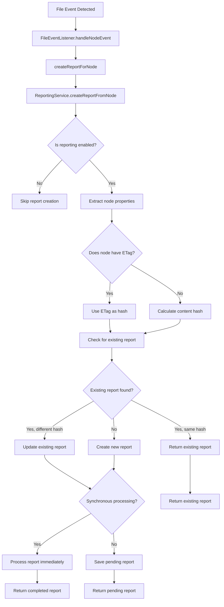
```mermaid
flowchart TD
    A[File Event Detected] --> B[FileEventListener.handleNodeEvent]
    B --> C[createReportForNode]
    C --> D[ReportingService.createReportFromNode]
    
    D --> E{Is reporting enabled?}
    E -->|No| F[Skip report creation]
    E -->|Yes| G[Extract node properties]
    
    G --> H{Does node have ETag?}
    H -->|Yes| I[Use ETag as hash]
    H -->|No| J[Calculate content hash]
    
    I --> K[Check for existing report]
    J --> K
    
    K --> L{Existing report found?}
    
    L -->|No| M[Create new report]
    L -->|Yes, same hash| N[Return existing report]
    L -->|Yes, different hash| O[Update existing report]
    
    O --> P{Synchronous processing?}
    M --> P
    
    P -->|Yes| Q[Process report immediately]
    P -->|No| R[Save pending report]
    
    Q --> S[Return completed report]
    R --> T[Return pending report]
    N --> U[Return existing report]
```

### Simplified Event Handling

DocuDesk has streamlined the report creation process by:

1. **Centralizing Decision Logic**: All decisions about whether to create reports and how to process them are now made in the ReportingService
2. **Automatic Processing Mode**: The system automatically determines whether to process reports synchronously based on configuration settings
3. **Single Responsibility**: Event listeners simply pass events to the ReportingService without making any decisions

This approach ensures consistent behavior and makes the system easier to maintain and extend.

### Report Update Logic

When a file is modified, DocuDesk updates the existing report rather than creating a new one:

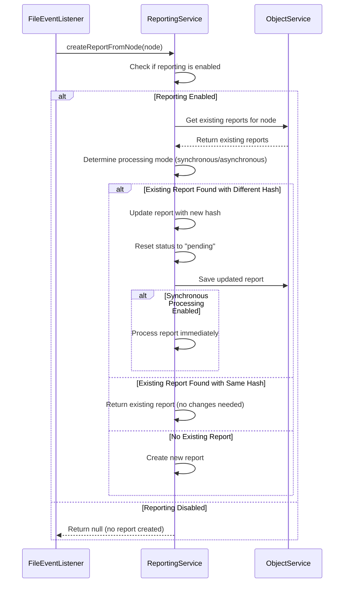
```mermaid
sequenceDiagram
    participant FL as FileEventListener
    participant RS as ReportingService
    participant OS as ObjectService
    
    FL->>RS: createReportFromNode(node)
    RS->>RS: Check if reporting is enabled
    
    alt Reporting Enabled
        RS->>OS: Get existing reports for node
        OS-->>RS: Return existing reports
        RS->>RS: Determine processing mode (synchronous/asynchronous)
        
        alt Existing Report Found with Different Hash
            RS->>RS: Update report with new hash
            RS->>RS: Reset status to "pending"
            RS->>OS: Save updated report
            
            alt Synchronous Processing Enabled
                RS->>RS: Process report immediately
            end
            
        else Existing Report Found with Same Hash
            RS->>RS: Return existing report (no changes needed)
        else No Existing Report
            RS->>RS: Create new report
        end
    else Reporting Disabled
        RS-->>FL: Return null (no report created)
    end
```

This logic ensures that reports are always up-to-date with the latest version of a file, while avoiding unnecessary processing when the file content hasn't changed.

## Analysis Types

### Anonymization Analysis

The anonymization analysis identifies personal data in documents that may need to be anonymized for GDPR compliance. It provides:

- Detection of various types of personal data (names, addresses, emails, etc.)
- Count and categorization of personal data instances
- Suggestions for anonymizing personal data
- Confidence scores for detected entities

### WCAG Compliance Analysis

The WCAG compliance analysis checks documents for accessibility issues according to the Web Content Accessibility Guidelines. It provides:

- Overall compliance level (A, AA, AAA, or non-compliant)
- Breakdown of issues by severity and WCAG principle
- Detailed list of accessibility issues with recommendations
- Overall compliance score

### Language Level Analysis

The language level analysis assesses the readability and complexity of document text. It provides:

- Primary language detection
- Various readability scores (Flesch-Kincaid, SMOG Index, etc.)
- Text complexity metrics
- Estimated education level required to understand the text
- Suggestions for improving language clarity

### Data Categories

DocuDesk recognizes the following categories of personal data:

- **name**: Names of individuals
- **address**: Physical addresses
- **email**: Email addresses
- **phone**: Phone numbers
- **id_number**: Identification numbers (passport, SSN, etc.)
- **financial**: Financial information (bank accounts, credit cards, etc.)
- **health**: Health-related information
- **biometric**: Biometric data
- **location**: Location data
- **other**: Other types of personal data

### Anonymization Status

The anonymization status can be one of the following:

- **not_required**: The file does not require anonymization
- **pending**: Anonymization is pending
- **in_progress**: Anonymization is in progress
- **completed**: Anonymization is completed
- **failed**: Anonymization failed

### Legal Basis

Under GDPR, personal data processing must have a legal basis. DocuDesk supports tracking the following legal bases:

- **consent**: The data subject has given consent
- **contract**: Processing is necessary for a contract
- **legal_obligation**: Processing is necessary for a legal obligation
- **vital_interests**: Processing is necessary to protect vital interests
- **public_interest**: Processing is necessary for a task in the public interest
- **legitimate_interests**: Processing is necessary for legitimate interests

## API Endpoints

DocuDesk provides the following API endpoints for managing document reports:

### API Flow

The following diagram illustrates the typical flow when using the report API:

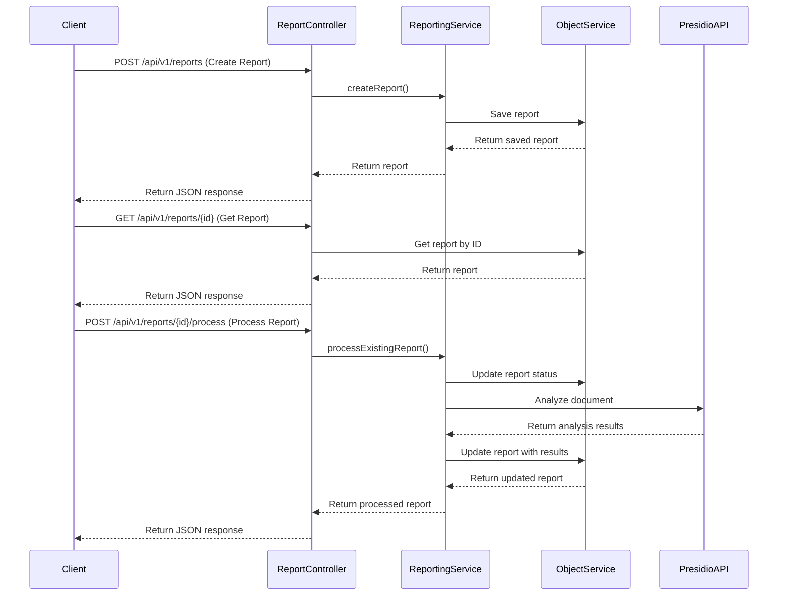
```mermaid
sequenceDiagram
    participant Client
    participant ReportController
    participant ReportingService
    participant ObjectService
    
    Client->>ReportController: POST /api/v1/reports (Create Report)
    ReportController->>ReportingService: createReport()
    ReportingService->>ObjectService: Save report
    ObjectService-->>ReportingService: Return saved report
    ReportingService-->>ReportController: Return report
    ReportController-->>Client: Return JSON response
    
    Client->>ReportController: GET /api/v1/reports/{id} (Get Report)
    ReportController->>ObjectService: Get report by ID
    ObjectService-->>ReportController: Return report
    ReportController-->>Client: Return JSON response
    
    Client->>ReportController: POST /api/v1/reports/{id}/process (Process Report)
    ReportController->>ReportingService: processExistingReport()
    ReportingService->>ObjectService: Update report status
    ReportingService->>PresidioAPI: Analyze document
    PresidioAPI-->>ReportingService: Return analysis results
    ReportingService->>ObjectService: Update report with results
    ObjectService-->>ReportingService: Return updated report
    ReportingService-->>ReportController: Return processed report
    ReportController-->>Client: Return JSON response
```

### List Document Reports

```
GET /apps/docudesk/api/v1/reports
```

Returns a list of document reports. You can filter the reports by:

- `node_id`: Filter reports by Nextcloud node ID
- `status`: Filter reports by status

### Create Document Report

```
POST /apps/docudesk/api/v1/reports
```

Creates a new document report. You need to specify:

- `node_id`: Nextcloud node ID of the document
- `file_name`: Name of the document
- `file_hash`: Hash of the file content
- `analysis_types`: Types of analysis to perform (anonymization, wcag_compliance, language_level)

### Get Document Report

```
GET /apps/docudesk/api/v1/reports/{reportId}
```

Returns a specific document report by ID.

### Update Document Report

```
PUT /apps/docudesk/api/v1/reports/{reportId}
```

Updates a specific document report.

### Get Latest Report for Node

```
GET /apps/docudesk/api/v1/reports/node/{nodeId}
```

Returns the latest document report for a specific Nextcloud node.

### Get Report Configuration

```
GET /apps/docudesk/api/v1/settings/report
```

Returns the current report configuration settings.

### Save Report Configuration

```
POST /apps/docudesk/api/v1/settings/report
```

Updates the report configuration settings. You can specify:

- `enable_reporting`: Whether to enable automatic report generation
- `synchronous_processing`: Whether to process reports immediately
- `confidence_threshold`: Minimum confidence level for entity detection (0-1)
- `store_original_text`: Whether to store the original document text in reports

## Use Cases

### GDPR Compliance

Document reports help ensure GDPR compliance by:

- Identifying documents containing personal data
- Suggesting anonymization methods for sensitive information
- Tracking anonymization status
- Providing an audit trail of privacy-related actions

### Accessibility Compliance

Document reports help ensure accessibility compliance by:

- Checking documents against WCAG standards
- Identifying accessibility issues
- Providing recommendations for fixing issues
- Tracking compliance levels over time

### Content Readability

Document reports help improve content readability by:

- Assessing the language level of documents
- Identifying complex language
- Suggesting simplifications
- Ensuring content is appropriate for the target audience

## Integration with Document Processing

The document reports system integrates with DocuDesk's document processing capabilities:

- Reports can trigger automatic document processing (e.g., anonymization)
- Processing results are reflected in updated reports
- Reports provide a history of document transformations

## Examples

### Generating a Document Report

```php
// Create a new document report
$reportData = [
    'node_id' => '12345',
    'file_name' => 'important-document.pdf',
    'file_hash' => 'a1b2c3d4e5f6g7h8i9j0',
    'analysis_types' => ['anonymization', 'wcag_compliance', 'language_level']
];

$response = $client->post('/apps/docudesk/api/v1/reports', [
    'json' => $reportData
]);

$report = json_decode($response->getBody(), true);
$reportId = $report['id'];

// Check report status
$response = $client->get('/apps/docudesk/api/v1/reports/' . $reportId);
$report = json_decode($response->getBody(), true);

if ($report['status'] === 'completed') {
    // Process report results
    $anonymizationResults = $report['anonymization_results'];
    $wcagResults = $report['wcag_compliance_results'];
    $languageResults = $report['language_level_results'];
    
    // Take action based on results
    if ($anonymizationResults['contains_personal_data']) {
        // Handle personal data
    }
    
    if ($wcagResults['compliance_level'] !== 'AA' && $wcagResults['compliance_level'] !== 'AAA') {
        // Address accessibility issues
    }
    
    if ($languageResults['education_level'] === 'graduate' || $languageResults['education_level'] === 'professional') {
        // Simplify language
    }
}
```

### Configuring Report Generation

```php
// Update report configuration
$configData = [
    'enable_reporting' => true,
    'synchronous_processing' => false, // Use background jobs
    'confidence_threshold' => 0.7,
    'store_original_text' => true
];

$response = $client->post('/apps/docudesk/api/v1/settings/report', [
    'json' => $configData
]);

// Get current report configuration
$response = $client->get('/apps/docudesk/api/v1/settings/report');
$config = json_decode($response->getBody(), true);
```

## Best Practices

1. **Asynchronous Processing**: For production environments, use asynchronous processing to reduce the impact on performance
2. **Regular Analysis**: Regularly analyze important documents to ensure continued compliance
3. **Hash-Based Updates**: Use file hashing to determine when documents have changed and need re-analysis
4. **Comprehensive Analysis**: Use all three analysis types for critical documents
5. **Action on Results**: Implement a workflow to address issues identified in reports
6. **Version Tracking**: Keep reports for different versions of documents to track improvements
7. **Confidence Threshold**: Adjust the confidence threshold based on your needs (higher for fewer false positives, lower for more comprehensive detection)

## Conclusion

Document reports provide a powerful way to ensure your documents meet privacy, accessibility, and readability standards. By automatically analyzing documents as they are created or modified, you can maintain compliance with regulations and improve the quality of your content without manual intervention.

## File Event Handling

DocuDesk uses Nextcloud's event system to detect file operations and trigger report generation. The following diagram illustrates how file events are handled:

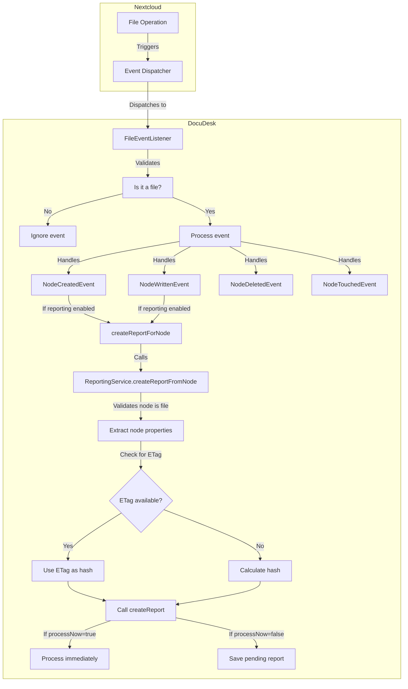
```mermaid
flowchart TD
    subgraph Nextcloud
        A[File Operation] -->|Triggers| B[Event Dispatcher]
    end
    
    subgraph DocuDesk
        B -->|Dispatches to| C[FileEventListener]
        
        C -->|Validates| D[Is it a file?]
        D -->|No| E[Ignore event]
        D -->|Yes| F[Process event]
        
        F -->|Handles| G[NodeCreatedEvent]
        F -->|Handles| H[NodeWrittenEvent]
        F -->|Handles| I[NodeDeletedEvent]
        F -->|Handles| J[NodeTouchedEvent]
        
        G -->|If reporting enabled| K[createReportForNode]
        H -->|If reporting enabled| K
        
        K -->|Calls| L[ReportingService.createReportFromNode]
        
        L -->|Validates node is file| M[Extract node properties]
        M -->|Check for ETag| N{ETag available?}
        
        N -->|Yes| O[Use ETag as hash]
        N -->|No| P[Calculate hash]
        
        O --> Q[Call createReport]
        P --> Q
        
        Q -->|If processNow=true| R[Process immediately]
        Q -->|If processNow=false| S[Save pending report]
    end
```

The event listener handles different types of file events:

- **NodeCreatedEvent**: Triggered when a new file is created
- **NodeWrittenEvent**: Triggered when a file's content is modified
- **NodeDeletedEvent**: Triggered when a file is deleted
- **NodeTouchedEvent**: Triggered when a file's metadata is updated

For file creation and modification events, the listener creates reports if reporting is enabled.

### Efficient File Change Detection

DocuDesk uses Nextcloud's ETag (Entity Tag) system when available to efficiently detect file changes:

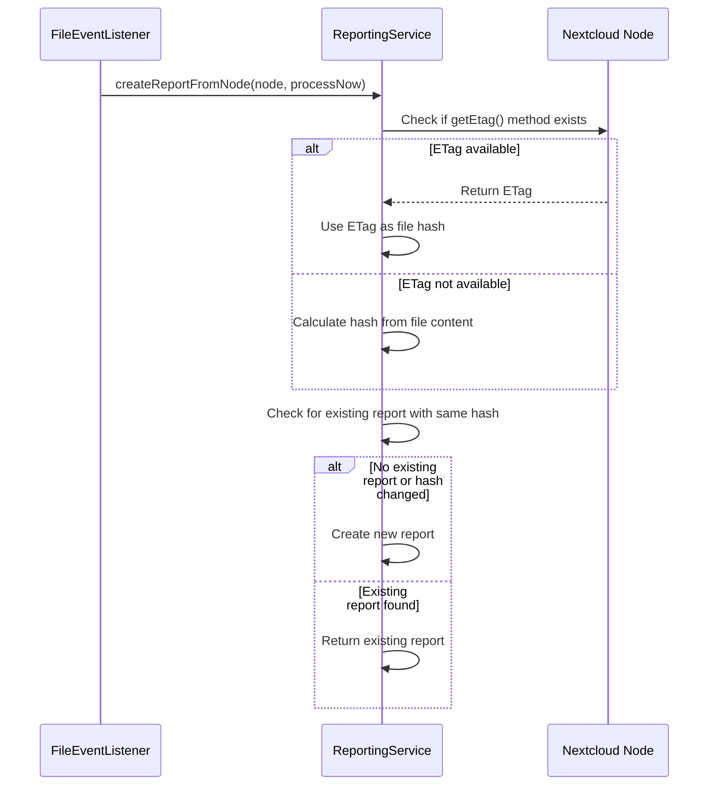
```mermaid
sequenceDiagram
    participant FL as FileEventListener
    participant RS as ReportingService
    participant Node as Nextcloud Node
    
    FL->>RS: createReportFromNode(node, processNow)
    RS->>Node: Check if getEtag() method exists
    
    alt ETag available
        Node-->>RS: Return ETag
        RS->>RS: Use ETag as file hash
    else ETag not available
        RS->>RS: Calculate hash from file content
    end
    
    RS->>RS: Check for existing report with same hash
    
    alt No existing report or hash changed
        RS->>RS: Create new report
    else Existing report found
        RS->>RS: Return existing report
    end
```

Using ETag provides several advantages:
- **Efficiency**: Avoids reading file content for large files
- **Accuracy**: ETags change whenever file content changes
- **Performance**: Reduces CPU and I/O overhead

## Report Processing Workflow

The report processing workflow involves several steps and state transitions. The following diagram illustrates the lifecycle of a report:

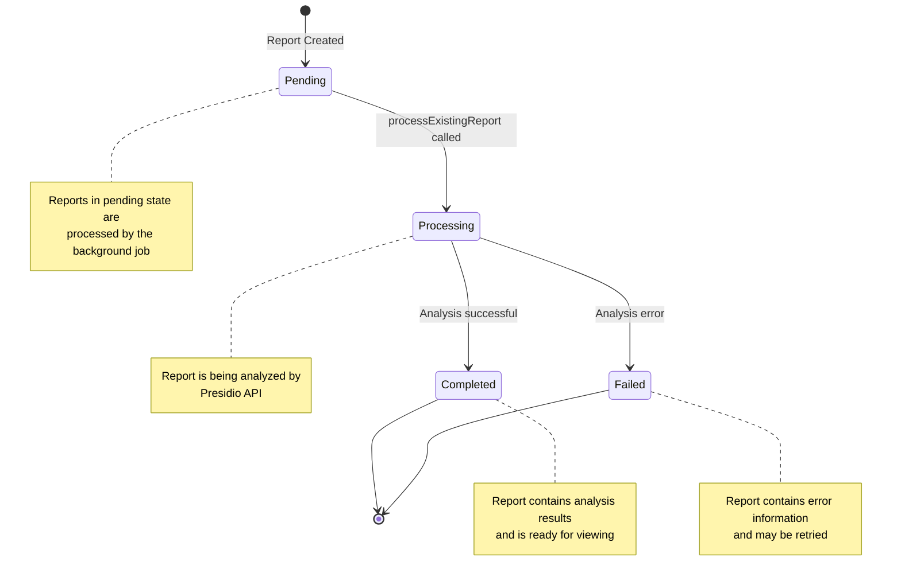
```mermaid
stateDiagram-v2
    [*] --> Pending: Report Created
    Pending --> Processing: processExistingReport called
    Processing --> Completed: Analysis successful
    Processing --> Failed: Analysis error
    Completed --> [*]
    Failed --> [*]
    
    note right of Pending
        Reports in pending state are
        processed by the background job
    end note
    
    note right of Processing
        Report is being analyzed by
        Presidio API
    end note
    
    note right of Completed
        Report contains analysis results
        and is ready for viewing
    end note
    
    note right of Failed
        Report contains error information
        and may be retried
    end note
```

### Report Processing Steps

The `ReportingService` handles report processing through the following steps:

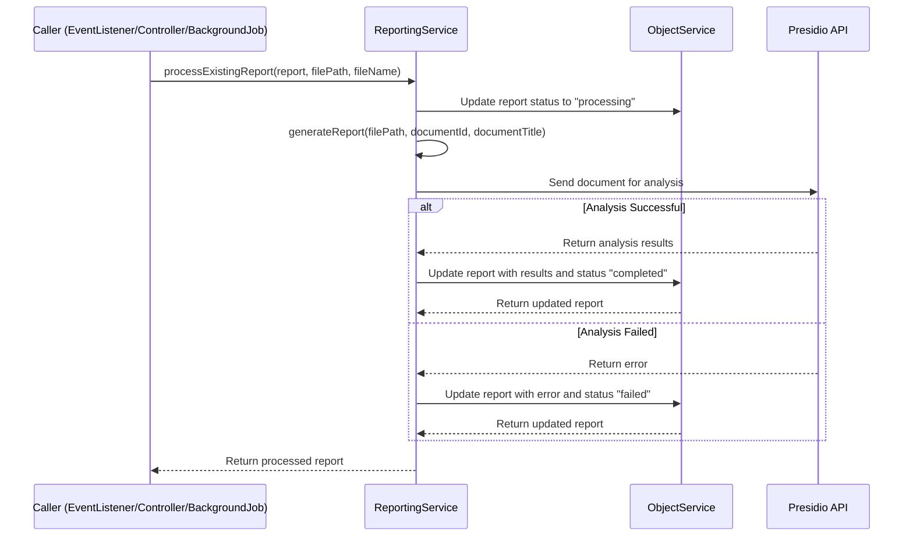
```mermaid
sequenceDiagram
    participant Caller as Caller (EventListener/Controller/BackgroundJob)
    participant RS as ReportingService
    participant OS as ObjectService
    participant PA as Presidio API
    
    Caller->>RS: processExistingReport(report, filePath, fileName)
    RS->>OS: Update report status to "processing"
    RS->>RS: generateReport(filePath, documentId, documentTitle)
    RS->>PA: Send document for analysis
    
    alt Analysis Successful
        PA-->>RS: Return analysis results
        RS->>OS: Update report with results and status "completed"
        OS-->>RS: Return updated report
    else Analysis Failed
        PA-->>RS: Return error
        RS->>OS: Update report with error and status "failed"
        OS-->>RS: Return updated report
    end
    
    RS-->>Caller: Return processed report
```

This centralized processing approach ensures consistent handling of reports regardless of how they are triggered (file events, API requests, or background jobs).

## Background Job Processing

DocuDesk uses a background job (`ProcessPendingReports`) to process pending reports asynchronously. This job runs periodically (every 15 minutes by default) and processes a batch of pending reports.

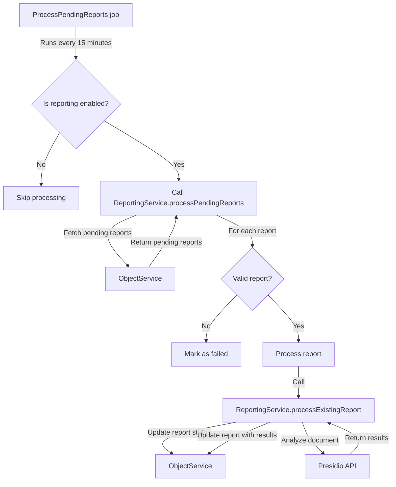
```mermaid
flowchart TD
    A[ProcessPendingReports job] -->|Runs every 15 minutes| B{Is reporting enabled?}
    B -->|No| C[Skip processing]
    B -->|Yes| D[Call ReportingService.processPendingReports]
    
    D -->|Fetch pending reports| E[ObjectService]
    E -->|Return pending reports| D
    
    D -->|For each report| F{Valid report?}
    F -->|No| G[Mark as failed]
    F -->|Yes| H[Process report]
    
    H -->|Call| I[ReportingService.processExistingReport]
    I -->|Update report status| J[ObjectService]
    I -->|Analyze document| K[Presidio API]
    K -->|Return results| I
    I -->|Update report with results| J
```

### Background Job Sequence

The following sequence diagram illustrates how the background job processes pending reports:

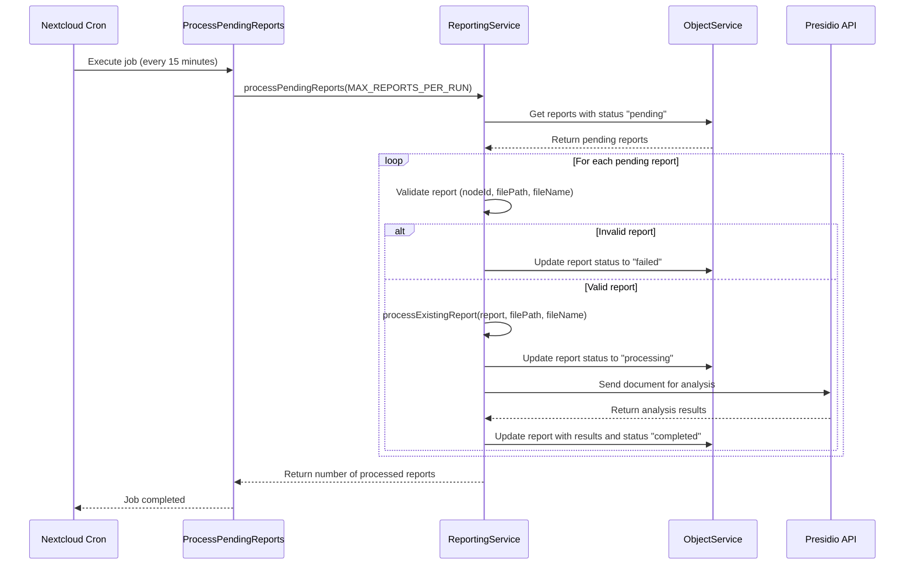
```mermaid
sequenceDiagram
    participant Cron as Nextcloud Cron
    participant PPR as ProcessPendingReports
    participant RS as ReportingService
    participant OS as ObjectService
    participant PA as Presidio API
    
    Cron->>PPR: Execute job (every 15 minutes)
    PPR->>RS: processPendingReports(MAX_REPORTS_PER_RUN)
    RS->>OS: Get reports with status "pending"
    OS-->>RS: Return pending reports
    
    loop For each pending report
        RS->>RS: Validate report (nodeId, filePath, fileName)
        
        alt Invalid report
            RS->>OS: Update report status to "failed"
        else Valid report
            RS->>RS: processExistingReport(report, filePath, fileName)
            RS->>OS: Update report status to "processing"
            RS->>PA: Send document for analysis
            PA-->>RS: Return analysis results
            RS->>OS: Update report with results and status "completed"
        end
    end
    
    RS-->>PPR: Return number of processed reports
    PPR-->>Cron: Job completed
```

This background processing approach allows DocuDesk to handle large volumes of documents efficiently without impacting user experience.

## Entity Detection and Risk Scoring

DocuDesk uses the Presidio API to detect entities in documents and calculate risk scores based on the detected entities.

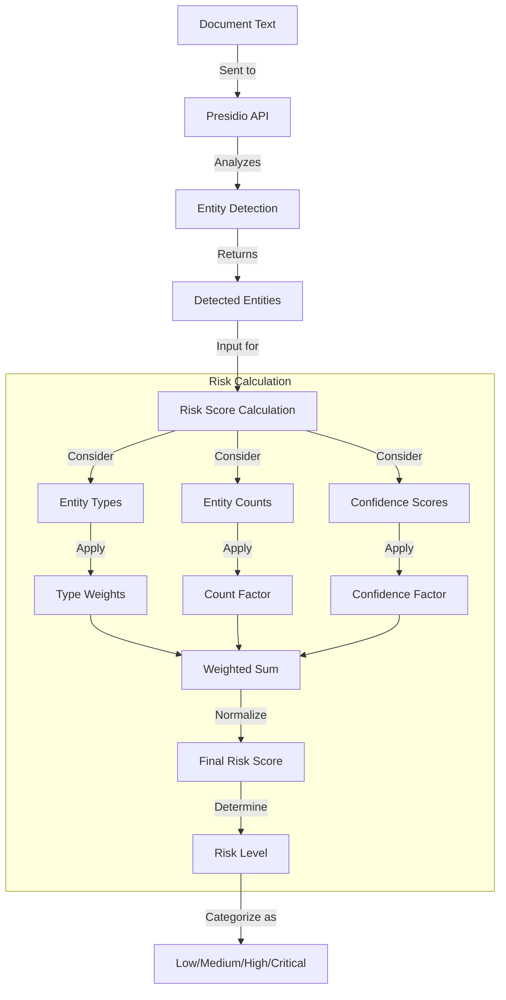
```mermaid
flowchart TD
    A[Document Text] -->|Sent to| B[Presidio API]
    B -->|Analyzes| C[Entity Detection]
    C -->|Returns| D[Detected Entities]
    
    D -->|Input for| E[Risk Score Calculation]
    
    subgraph Risk Calculation
        E -->|Consider| F[Entity Types]
        E -->|Consider| G[Entity Counts]
        E -->|Consider| H[Confidence Scores]
        
        F -->|Apply| I[Type Weights]
        G -->|Apply| J[Count Factor]
        H -->|Apply| K[Confidence Factor]
        
        I --> L[Weighted Sum]
        J --> L
        K --> L
        
        L -->|Normalize| M[Final Risk Score]
        M -->|Determine| N[Risk Level]
    end
    
    N -->|Categorize as| O[Low/Medium/High/Critical]
```

### Entity Detection Process

The following sequence diagram illustrates how entities are detected and risk scores are calculated:

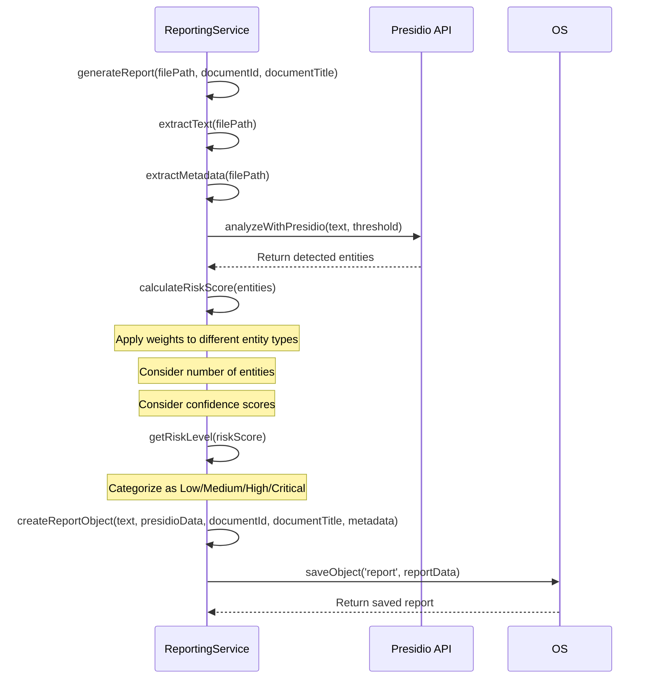
```mermaid
sequenceDiagram
    participant RS as ReportingService
    participant PA as Presidio API
    
    RS->>RS: generateReport(filePath, documentId, documentTitle)
    RS->>RS: extractText(filePath)
    RS->>RS: extractMetadata(filePath)
    RS->>PA: analyzeWithPresidio(text, threshold)
    
    PA-->>RS: Return detected entities
    
    RS->>RS: calculateRiskScore(entities)
    Note over RS: Apply weights to different entity types
    Note over RS: Consider number of entities
    Note over RS: Consider confidence scores
    
    RS->>RS: getRiskLevel(riskScore)
    Note over RS: Categorize as Low/Medium/High/Critical
    
    RS->>RS: createReportObject(text, presidioData, documentId, documentTitle, metadata)
    RS->>OS: saveObject('report', reportData)
    OS-->>RS: Return saved report
```

### Risk Score Calculation

The risk score is calculated based on the following factors:

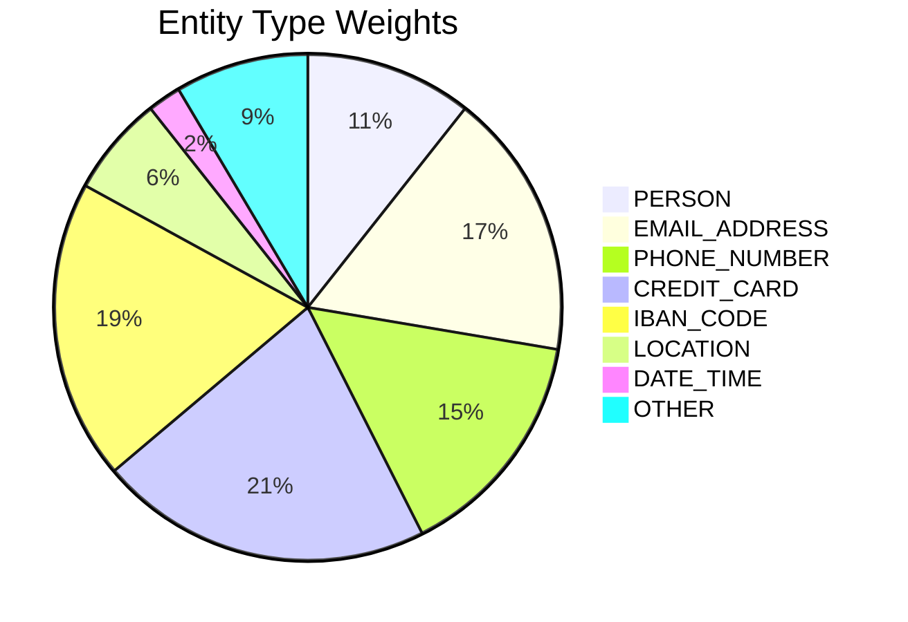
```mermaid
pie title Entity Type Weights
    "PERSON" : 5
    "EMAIL_ADDRESS" : 8
    "PHONE_NUMBER" : 7
    "CREDIT_CARD" : 10
    "IBAN_CODE" : 9
    "LOCATION" : 3
    "DATE_TIME" : 1
    "OTHER" : 4
```

The final risk score determines the risk level:

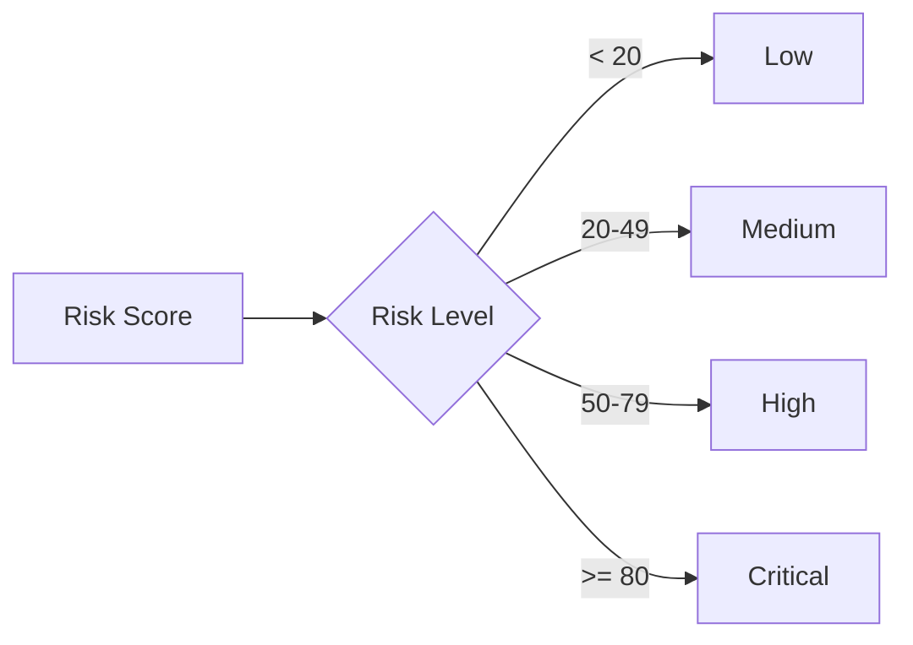
```mermaid
graph LR
    A[Risk Score] --> B{Risk Level}
    B -->|< 20| C[Low]
    B -->|20-49| D[Medium]
    B -->|50-79| E[High]
    B -->|>= 80| F[Critical]
```

This risk assessment helps organizations prioritize which documents need attention for privacy compliance. 