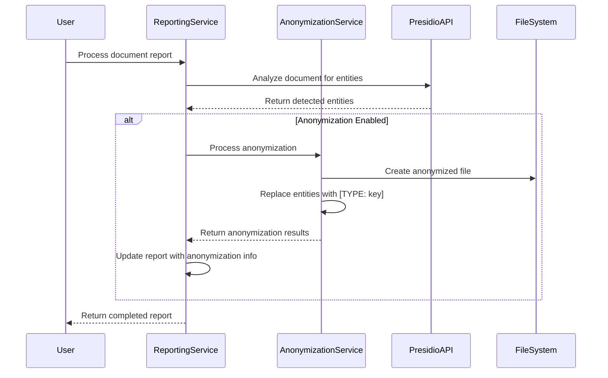

import Tabs from '@theme/Tabs';
import TabItem from '@theme/TabItem';

# 🔒 GDPR Anonymization

DocuDesk provides powerful document anonymization capabilities to help you comply with GDPR and other privacy regulations. The anonymization feature automatically detects and redacts sensitive personal information in your documents, making it easier to share and process documents while protecting individual privacy.

## Overview

The anonymization process follows these steps:

1. **Text Extraction**: Extract text content from various document formats
2. **Entity Detection**: Identify sensitive information using Microsoft Presidio
3. **Text Anonymization**: Replace or mask sensitive information
4. **Document Generation**: Create a new anonymized document
5. **Logging**: Record anonymization details for compliance purposes

## Key Features

- **Automatic Detection**: Identifies various types of personal data without manual tagging
- **Configurable Anonymization**: Customize how different types of information are anonymized
- **De-anonymization**: Option to restore original text when authorized
- **Detailed Logging**: Maintains records of all anonymization operations
- **Multiple Document Formats**: Works with PDF, Word, Excel, and text documents

## Supported Entity Types

The anonymization service can detect and anonymize various types of sensitive information:

- Personal names
- Email addresses
- Phone numbers
- Credit card numbers
- Bank account numbers
- Social security numbers
- Addresses and locations
- Dates of birth
- IP addresses
- Medical license numbers
- Passport numbers
- Driver's license numbers

## Anonymization Methods

DocuDesk supports different anonymization methods for different types of data:

- **Replacement**: Replace the entity with a generic placeholder (e.g., [PERSON])
- **Masking**: Replace characters with a masking character (e.g., ******)
- **Hashing**: Replace the entity with a hash value
- **Redaction**: Completely remove the entity from the text

## Automatic Anonymization with Reports

DocuDesk now supports automatic anonymization of documents when reports are processed. When the anonymization feature is enabled in the settings, the system will:

1. Process the document report as usual, detecting sensitive entities
2. Automatically create an anonymized version of the document with the same name plus "_anonymized" suffix
3. Replace all detected sensitive entities with placeholders in the format `[ENTITY_TYPE: key]`
4. Store the anonymization log with references to both the original and anonymized files
5. Update the report with anonymization results

This integration provides a seamless workflow for identifying and anonymizing sensitive information in documents.

### How It Works

When a document report is processed:



### Configuration

Anonymization can be enabled or disabled in the DocuDesk admin settings. When enabled, all documents processed for reporting will automatically be anonymized.

### Accessing Anonymized Documents

Anonymized documents are stored in the same folder as the original document, with "_anonymized" added to the filename. For example, if the original document is "contract.pdf", the anonymized version will be "contract_anonymized.pdf".

The report details will include links to both the original and anonymized documents, making it easy to access either version.

## Manual Anonymization

In addition to automatic anonymization, you can also manually anonymize documents using the API:

```php
$anonymizationService = \OC::$server->get(OCA\DocuDesk\Service\AnonymizationService::class);
$result = $anonymizationService->anonymizeDocument(
    '/path/to/document.pdf',
    '/path/to/output/anonymized.pdf',
    'doc-123',
    'Important Contract'
);
```

## Retrieving Anonymization Data

You can retrieve anonymization data for a specific file:

```php
// Get anonymization data for a file node
$anonymizationService = \OC::$server->get(OCA\DocuDesk\Service\AnonymizationService::class);
$anonymization = $anonymizationService->getAnonymization($fileNode);

// Or retrieve anonymization by ID
$anonymization = $anonymizationService->getAnonymizationById('anonymization-id');
```

## De-anonymization

If you need to recover the original content, you can de-anonymize a document using the anonymization log ID:

```php
$result = $anonymizationService->deanonymizeDocument(
    'anonymization-log-id',
    '/path/to/output/deanonymized.pdf'
);
```

## Anonymization Logs

You can retrieve anonymization logs to track anonymization activities:

```php
$logs = $anonymizationService->getAnonymizationLogs('doc-123');
```

## Integration with Presidio

The anonymization feature integrates with Microsoft Presidio, an open-source PII detection and anonymization service:

- Uses Presidio Analyzer for entity detection
- Uses Presidio Anonymizer for text anonymization
- Configurable confidence threshold for entity detection
- Customizable anonymization operators for different entity types

## Configuration

Configure the anonymization feature in the DocuDesk admin settings:

1. Navigate to **Admin Settings** > **DocuDesk**
2. Set the **Presidio Analyzer API URL** (default: http://presidio-api:8080/analyze)
3. Set the **Presidio Anonymizer API URL** (default: http://presidio-api:8080/anonymize)
4. Adjust the **Confidence Threshold** (0.0-1.0) for entity detection sensitivity
5. Enable or disable the **Store Original Text** option for de-anonymization capability

### OpenRegisters Integration

DocuDesk supports storing anonymization data in OpenRegisters, which provides additional capabilities for data management:

1. **External Storage**: Store anonymization logs in external databases through OpenRegisters
2. **Advanced Querying**: Use OpenRegisters' query capabilities for complex searches
3. **Data Sharing**: Share anonymization logs with other applications that use OpenRegisters

To configure OpenRegisters integration:

1. Install the OpenRegisters app from the Nextcloud App Store
2. In DocuDesk settings, select "OpenRegister" as the storage source for anonymization data
3. Choose the appropriate register and schema for storing the data

This integration is optional - if you prefer to use Nextcloud's internal storage, select "Internal" as the storage source.

## Setting Up Presidio

To use the anonymization feature, you need to set up Microsoft Presidio:

1. Deploy Presidio using Docker or Kubernetes (see [Presidio documentation](https://microsoft.github.io/presidio/))
2. Configure the analyzer service with appropriate recognition models
3. Configure the anonymizer service with desired anonymization methods
4. Update the DocuDesk settings with your Presidio API URLs

## Security Considerations

The anonymization feature is designed with security in mind:

- All communication with Presidio is secured
- Anonymization logs are stored securely within your Nextcloud instance
- Original text storage is optional and can be disabled for higher security
- Access to anonymization features can be restricted based on user permissions

## Compliance Benefits

Document anonymization supports various compliance scenarios:

- **GDPR Article 5**: Helps implement data minimization principles
- **GDPR Article 9**: Assists in handling special categories of personal data
- **GDPR Article 17**: Supports the right to erasure by anonymizing personal data
- **GDPR Article 25**: Implements privacy by design through data protection measures
- **GDPR Article 32**: Enhances security of processing through pseudonymization

## Limitations

Be aware of these limitations:

- Detection accuracy depends on Presidio's recognition capabilities
- Some context-specific PII may not be detected without custom recognizers
- Very large documents may require additional processing time
- Image-based documents require OCR before anonymization (not included)
- Formatting may be lost in the anonymized document

## Best Practices

For optimal results with the anonymization feature:

1. **Test with Sample Data**: Verify anonymization effectiveness with representative documents
2. **Adjust Confidence Threshold**: Fine-tune the threshold based on your needs
3. **Review Anonymized Documents**: Always review automatically anonymized documents
4. **Customize Entity Types**: Configure custom entity recognizers for domain-specific data
5. **Implement Access Controls**: Restrict access to de-anonymization capabilities

## License

DocuDesk is licensed under the European Union Public License (EUPL), version 1.2 only. This is an open-source license that is compatible with many other open-source licenses while providing strong copyleft protections. The full text of the license can be found at [https://joinup.ec.europa.eu/collection/eupl/eupl-text-eupl-12](https://joinup.ec.europa.eu/collection/eupl/eupl-text-eupl-12).

Key aspects of the EUPL-1.2 license:

- You can use, modify, and distribute the software
- If you distribute modified versions, you must make the source code available
- Compatible with other licenses like GPL, AGPL, MPL, and more
- Provides clear patent licensing provisions
- Available in all official EU languages with equal validity

## Technical Implementation Notes

### Dependency Management

The `AnonymizationService` and `ReportingService` have a mutual dependency relationship. To avoid circular dependency issues, the `AnonymizationService` uses setter injection for the `ReportingService` dependency:

```php
// In ReportingService constructor
public function __construct(
    // ... other dependencies
    AnonymizationService $anonymizationService
) {
    // ... other initializations
    $this->anonymizationService = $anonymizationService;
    
    // Set this service in the anonymization service to avoid circular dependency
    $this->anonymizationService->setReportingService($this);
}

// In AnonymizationService
public function setReportingService(ReportingService $reportingService): void
{
    $this->reportingService = $reportingService;
}
```

This approach ensures that both services can reference each other without causing infinite loops during dependency resolution.
