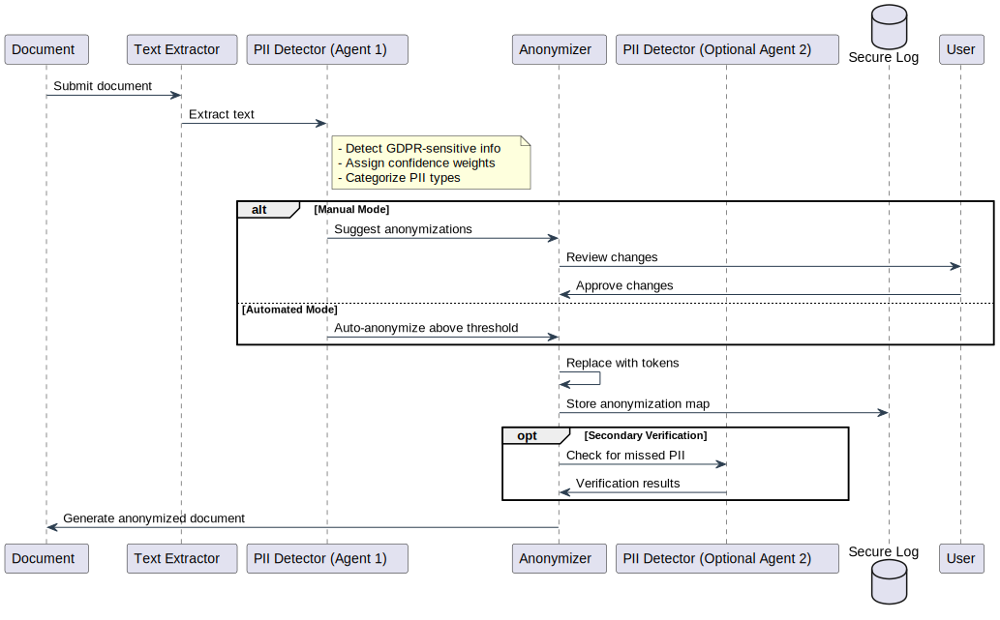

import Tabs from '@theme/Tabs';
import TabItem from '@theme/TabItem';

# 🔒 GDPR Anonymization

## Overview
Transform sensitive documents into GDPR-compliant versions while maintaining document integrity. Our local processing ensures your sensitive data never leaves your secure environment.

## Anonymization Tool
While DocuDesk allows you to integrate your preferred anonymization tool, we recommend using Presidio, an open-source solution developed specifically for PII detection and anonymization. Detailed installation instructions for Presidio can be found at https://github.com/MWest2020/presidio-nl/tree/main/docs.

## How It Works

### Process Flow

1. Document Processing
   - The document is converted to a text representation
   - Text is sent to the anonymization API

2. PII Detection
   - The tool analyzes the text for potential GDPR-sensitive information
   - Each detected item receives a confidence weight
   - Items are categorized by type (e.g., names, addresses, phone numbers)

3. Anonymization
   - Manual Mode: Users review suggested anonymizations and approve changes
   - Automated Mode: Items above configured confidence threshold are automatically anonymized
   - Each sensitive item is replaced with a randomized token
   - A detailed log is maintained for potential de-anonymization

4. Verification (Optional)
   - Document can be passed to a secondary agent for additional verification
   - Helps ensure no sensitive information was missed

## Features

### Detection & Processing
- AI-powered PII detection
- Context-aware anonymization
- Multiple anonymization methods
  - Redaction
  - Pseudonymization
  - Generalization
- Reversible anonymization with secure logging
- Double-check verification option
